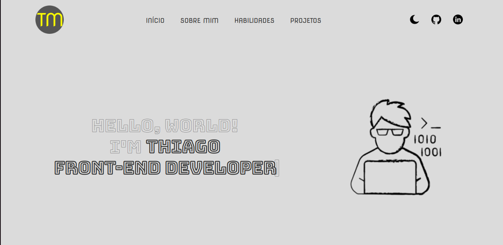
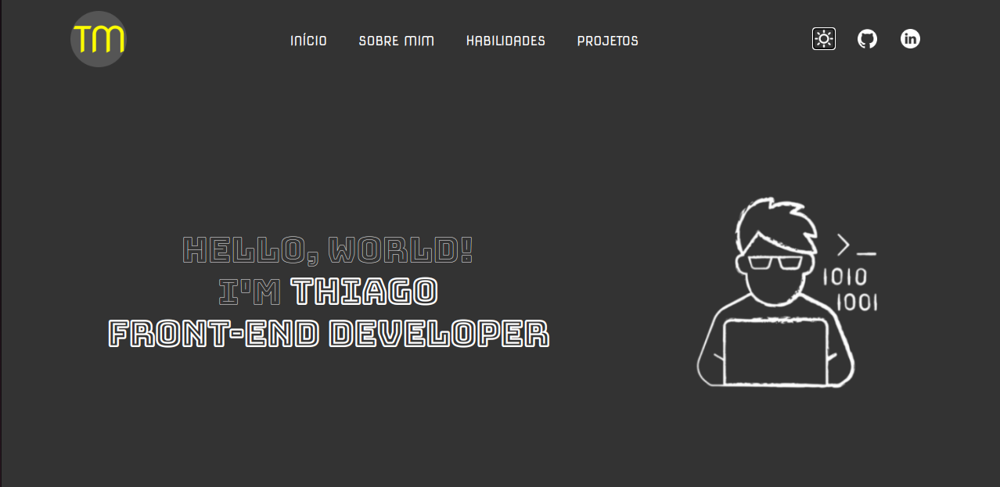

# Meu Portfólio

Bem-vindo ao Meu Portfólio! Este é um projeto desenvolvido em React que apresenta minhas habilidades, informações sobre mim e meus projetos. Ele também inclui um modo escuro e um modo claro para uma experiência de usuário mais agradável.

## Recursos

- Exibição das minhas habilidades
- Página "Sobre Mim" com informações pessoais
- Lista de projetos que desenvolvi
- Modo Escuro e Modo Claro para personalizar a aparência

## Tecnologias Utilizadas

- React
- React Router DOM
- Scrollreveal
- Typeit

## Capturas de Tela

## Instalação

1. Clone este repositório: `git clone https://github.com/othiagomanhaes/meu-portfolio.git`
2. Acesse o diretório do projeto: `cd meu-portfolio`
3. Instale as dependências: `npm install`

## Uso

1. Inicie o servidor de desenvolvimento: `npm start`
2. Abra o navegador e acesse: `http://localhost:3000`

## Modo Escuro e Modo Claro

O projeto possui suporte a Modo Escuro e Modo Claro. Para alternar entre os modos, clique no ícone de sol ou lua no canto superior direito.

## Rotas

- Habilidades: `/skills`
- Sobre Mim: `/aboutme`
- Projetos: `/projects`

## Contribuição

Contribuições são bem-vindas! Sinta-se à vontade para abrir uma [issue](https://github.com/othiagomanhaes/meu-projeto-incrivel/issues) ou enviar um [pull request](https://github.com/othiagomanhaes/meu-projeto-incrivel/pulls).

## Licença

Este projeto está sob a licença MIT. Consulte o arquivo [LICENSE](LICENSE) para obter mais informações.

---

Feito com ❤️ por [Thiago Manhães](https://github.com/othiagomanhaes)
